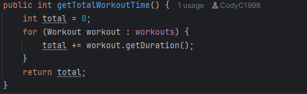
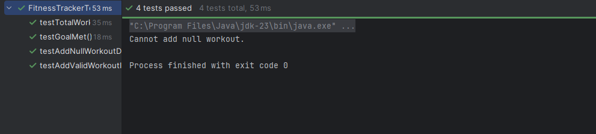

# 🏋️ Fitness Tracker – SDAT & DEV OPS QAP1
## Author: Cody Collins

## 📌 Project Overview

This Java-based Fitness Tracker allows users to:
- Log workouts with a name, duration, and date
- Track progress by calculating total workout time and workouts completed this week
- Set and evaluate weekly workout goals

The project is built using Java with Maven for dependency management and JUnit 5 for testing. GitHub Actions is configured for automated testing on every commit and pull request.

---

## 🧼 Clean Code Practices

This project follows clean code principles throughout. Here are a few examples:

### ✅ 1. Descriptive Naming

```java
public void addWorkout(Workout workout);
```

Method and variable names clearly describe their function. No vague identifiers like `data` or `temp`.

---

### ✅ 2. Encapsulation and Safe Data Access

```java
private final List<Workout> workouts;
```

Workouts are stored privately and accessed via a copy:

```java
public List<Workout> getAllWorkouts() {
    return new ArrayList<>(workouts);
}
```

This prevents unwanted external modification and protects internal state.

---

### ✅ 3. Single Responsibility Principle

```java
public int getTotalWorkoutTime();
```

Each method performs one task, improving clarity and testability. This method calculates total time spent working out — nothing more.




---

## ✅ Features Implemented

| Feature                     | Status |
|-----------------------------|--------|
| Log a workout               | ✅ Done |
| View total workout time     | ✅ Done |
| Track workouts this week    | ✅ Done |
| Set a weekly goal           | ✅ Done |
| Check if goal is met        | ✅ Done |
| Unit testing                | ✅ Done |
| GitHub Actions CI           | ✅ Done |

---

## 🧪 Unit Tests

Tests were written using JUnit 5 to ensure correctness. Both **positive** and **negative** cases are covered.

### ✨ Examples

#### ✅ Workout Class

```java
@Test
void testWorkoutConstructorAndGetters() {
    Workout workout = new Workout("Yoga", 60, LocalDate.of(2025, 6, 1));
    assertEquals("Yoga", workout.getName());
    assertEquals(60, workout.getDuration());
    assertEquals(LocalDate.of(2025, 6, 1), workout.getDate());
}
```

#### ✅ FitnessTracker Class

```java
@Test
void testTotalWorkoutTime() {
    FitnessTracker tracker = new FitnessTracker();
    tracker.addWorkout(new Workout("Run", 30, LocalDate.now()));
    tracker.addWorkout(new Workout("Swim", 40, LocalDate.now()));
    assertEquals(70, tracker.getTotalWorkoutTime());
}
```

#### ✅ Goal Evaluation

```java
@Test
void testGoalMet() {
    FitnessTracker tracker = new FitnessTracker();
    tracker.addWorkout(new Workout("Run", 30, LocalDate.now()));
    tracker.addWorkout(new Workout("Swim", 40, LocalDate.now()));
    tracker.addWorkout(new Workout("Bike", 60, LocalDate.now()));

    Goal goal = new Goal("Workout 3 times a week", 3);
    assertTrue(tracker.isGoalMet(goal));
}
```



---

## 📦 Dependencies Used

### From `pom.xml`

#### 🧪 JUnit 5

```xml
<dependency>
  <groupId>org.junit.jupiter</groupId>
  <artifactId>junit-jupiter</artifactId>
  <version>5.10.0</version>
  <scope>test</scope>
</dependency>
```

---

## ⚙️ GitHub Actions Setup

Located at `.github/workflows/maven.yml`:

```yaml
name: Java CI

on:
  push:
  pull_request:

jobs:
  build:
    runs-on: ubuntu-latest
    steps:
      - uses: actions/checkout@v3
      - name: Set up JDK 17
        uses: actions/setup-java@v3
        with:
          java-version: '17'
          distribution: 'temurin'
      - name: Build with Maven
        run: mvn clean install
```


---

## ❗ Problems Encountered

### 🧨 GitHub Actions Java Version Error

**Issue**: Build failed with `invalid target release: 23`  
**Fix**: Changed the Java version in `pom.xml` to `17` to match GitHub Actions' environment.

---

## ✅ Final Notes

This project fulfills all the key requirements of the QAP:

- ✅ Object-oriented design with clean structure
- ✅ Logging, tracking, and goal-setting functionality
- ✅ At least 3 unit tests (including both positive and negative cases)
- ✅ Maven-managed project structure
- ✅ GitHub Actions CI pipeline
- ✅ Code documented and clean code practices followed

Thanks for reviewing my submission!
